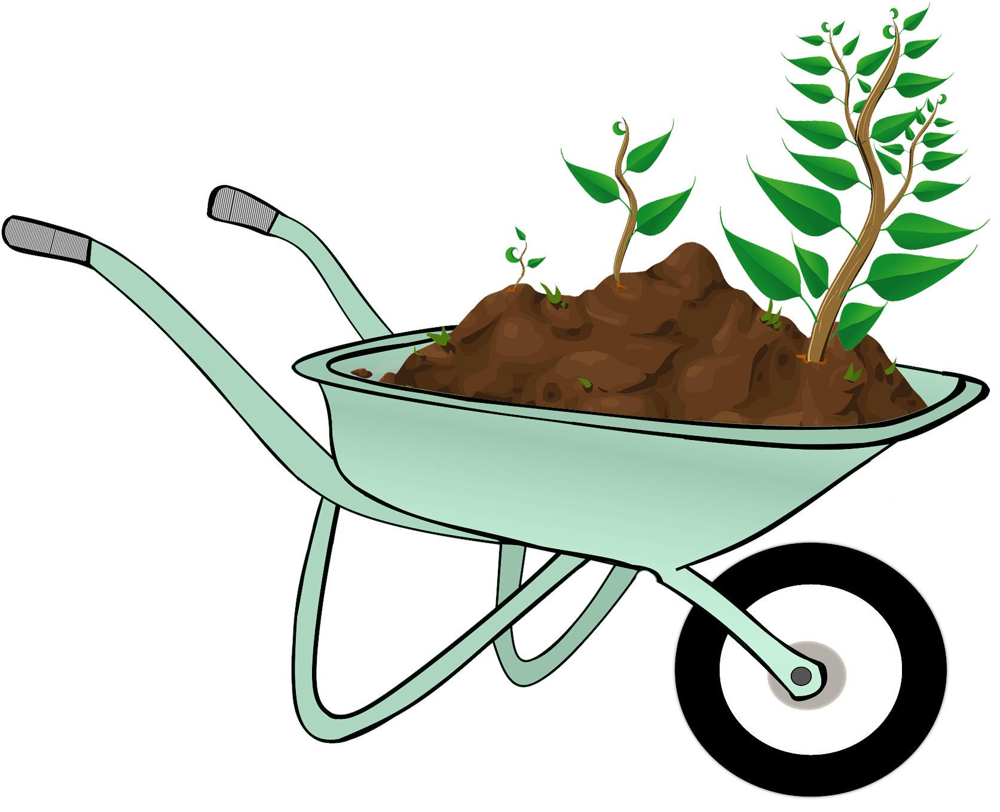

## 
 About the Society</img>

The University of Cambridge Allotment Society was created as an informal space to bring together all those who are involved with their college allotments and create a community. We exchange knowledge, ideas, and seeds, while partnering with local charities, donating surplus produce to community kitchens and food banks. We also host events such as allotment tours, skills fairs, and a harvest festival including a dinner made from our produce! The society is open to everyone, with absolutely no time commitment or knowledge required. If your college does not have an allotment but you wish to start one then we can also provide resources and tips on how to go about doing this. To get involved, join our facebook group, slack channel, or email us at cam.uni.allotment@gmail.com to ask any questions!

## 
Our Goals

We aim to promote university-wide physical and mental wellbeing, to combat loneliness and increase mindfulness for students, staff, alumni and fellows. We also promote sustainability, by reducing food waste and eating healthy, fresh, local, seasonal produce: aiming to tackle the climate crisis on a local level. We make donations to local food banks, community kitchens and charities to tackle food poverty, and promote a sense of community; bridging the ‘town and gown’ divide. We want to increase knowledge of where food comes from, provide horticultural demonstrations, and exchange recipes through a community of like-minded individuals. We also hope to encourage those colleges who do not currently have an allotment to start one! 

## 
College Allotments

Here is some information about each college's allotment or gardening society and how to get in touch if you would like to be a part of it! If your college does not have an allotment but you would like to set one up, please get in touch and we can give you some resources and tips on setting one up!

  
 <b>‣ Clare </b>

  
  Contact Charlotte Dunn (ckd25) or Joe Landman (jl832) to get involved in the Clare Grower Group!
  

  
 <b>‣ Clare Hall</b>

  
  See a video made for the University Wellness Festival documenting the progress of the Clare Hall Allotment from its beginnings in 2020 <a href="https://www.youtube.com/watch?v=ZmPv5DF7_UE" class="class2">here</a>. Contact Sarah Gough (sag66) or Claire Coffey (cic31) to get involved in the Clare Hall Allotment and find them on instagram  <a href="https://www.instagram.com/clarehallallotment/" class="class2">here</a>!
  

  
 <b>‣ Corpus Christi </b>

  
  Contact Darius Kos (dgk28) to get involved in the allotment at Lekhampton site!
  

  
 <b>‣ Darwin </b>

  
  Contact Meg Groom or Chris Davis to get involved in the DarGar society!
  

  
 <b>‣ Fitzwilliam </b>

  
  At Fitzwilliam, the college gardeners grow produce in the gardens. Contact head gardener Steve Kidger to get involved!
  

  
 <b>‣ Girton </b>

  
  Contact Jules Pye (jpp49) to get involved in the Girton green society!
  

  
 <b>‣ Gonville and Caius </b>

  
  Contact Moby Wells (mtw42) or Anya Williams (aow24) to get involved in the Gonville and Caius Allotment Society and find them on instagram  <a href="https://www.instagram.com/caiusallotmentsociety/" class="class2">here</a> or Facebook <a href="https://www.facebook.com/groups/612713673066723" class="class2">here</a>!
  

  
 <b>‣ Homerton </b>

  
  Contact James Burrows (jsb213) to get involved in the Homerton Rock Allotment Society!
  

  
 <b>‣ Newnham </b>

  
  Newnham has two gardening societies: Newnham allotment gardeners and Newnham student garden club. Contact the head gardener Lottie Collis (head.gardener@newn.cam.ac.uk) to get involved in Newnham Allotment Gardeners. Contact Lily Hands (lah78) or studentgardencommittee@newn.cam.ac.uk to get invovled in the Newnham Student Garden Club and find them on Facebook <a href="https://www.facebook.com/search/top?q=newnham%20garden%20club" class="class2">here</a>!
  

  
 <b>‣ Pembroke </b>

  
  Contact Maryam Grassly (mg996) to get involved in the Pembroke College Gardening Society and find them on Facebook <a href=" https://www.facebook.com/groups/609423512751287/" class="class2">here</a>! 
  

  
 <b>‣ Robinson </b>

  
  Contact Hannah Walters to get involved in the Robinson Gardening Society and find them on Facebook <a href="https://www.facebook.com/groups/robinsonplantingplants/" class="class2">here</a>! 
  

  
 <b>‣ St Catherine's </b>

  
  Contact Rory Cockshaw to get involved in the St Catherine's allotment!
  

  
 <b>‣ St Edmond's </b>

  
  Contact Florence Cochrane to get involved in the St Edmond's allotment!
  

  
 <b>‣ St John's </b>

  
  Contact the MCR to get involved in the St John's allotment!
  

  
 <b>‣ Trinity </b>

  
  Contact Alessa Weiler or Julia Frieberger to get involved in the Trinity green thumbs vegetable garden!
  

  
 <b>‣ Wolfson </b>

  
  Contact Millie Race (ar2065) to get involved in the Wolfson College Student Garden and find them on instagram <a href="https://www.instagram.com/wolfsonstudentgarden/" class="class2">here</a>! 
  

<!---
## 
Collaborations

Information about any collaborations or projects with charities etc 

## 
Events

Social meetups, trips, etc --->

## 
Contact

For any more information, including how to get involved, please contact cam.uni.allotment@gmail.com. 
